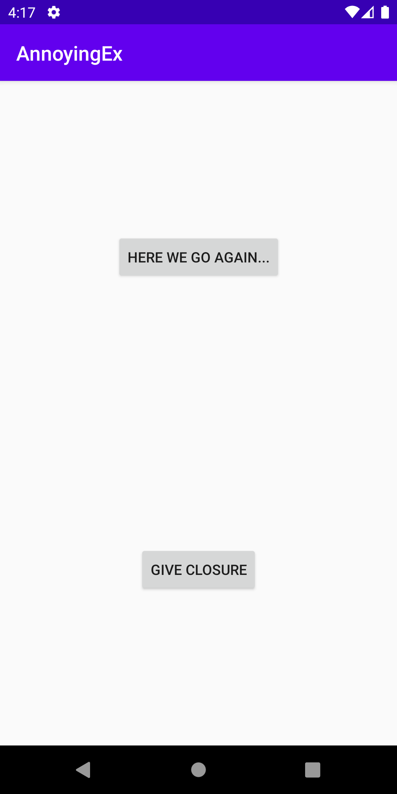
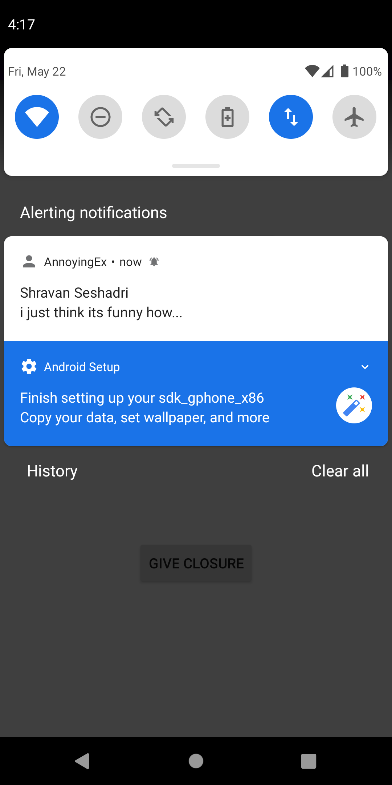
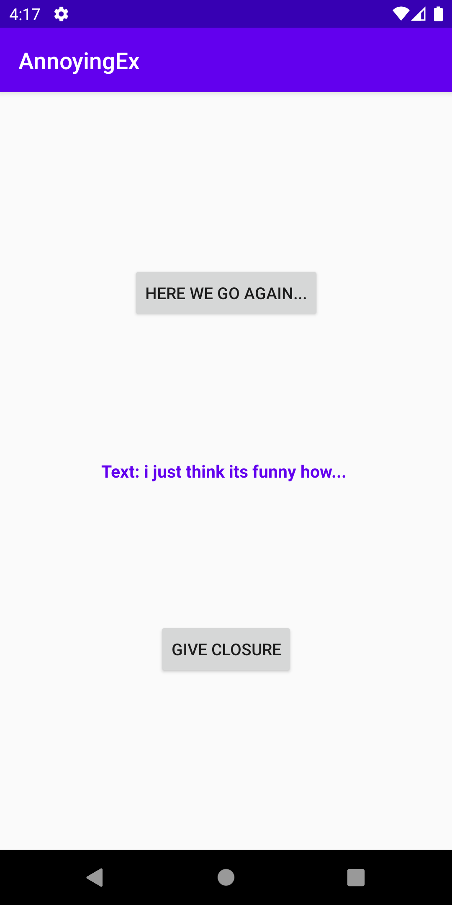

# HW5: The Annoying Ex by Ashmann Syngle

This app is called, “The Annoying Ex”, where every 20 minutes, the phone will ping notifications with messages such as, “hey you up?, “wyd”, “I miss you”, “can we talk”, “i still love you”, “plz unblock me”, “Netflix n chill?”. But it also has the ability to block them with a “Give Closure” button.

## Screenshots

## Extra credit - HW5
I have completed extra credit #1 and #2

## Installation & Usage
N/A 